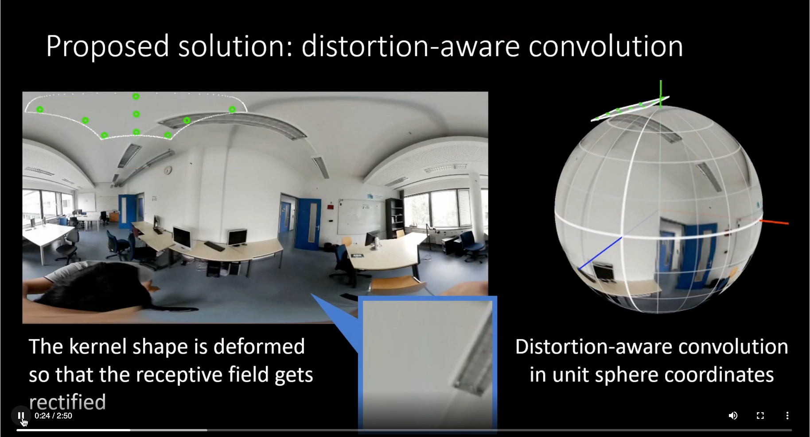
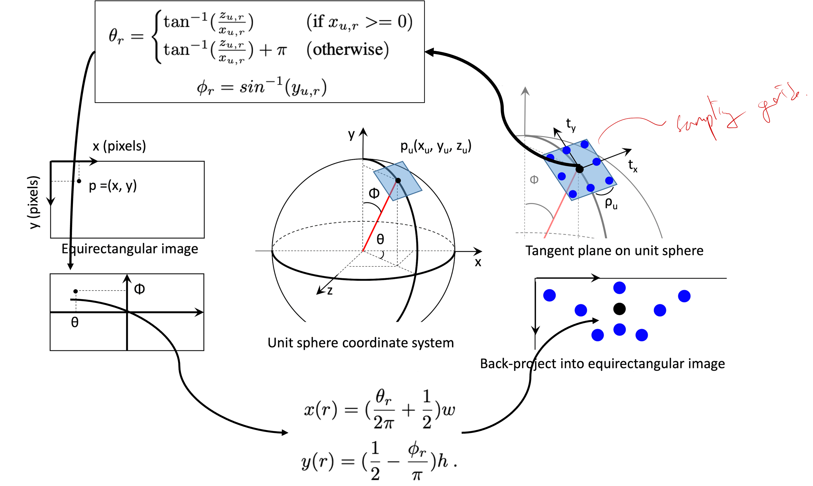
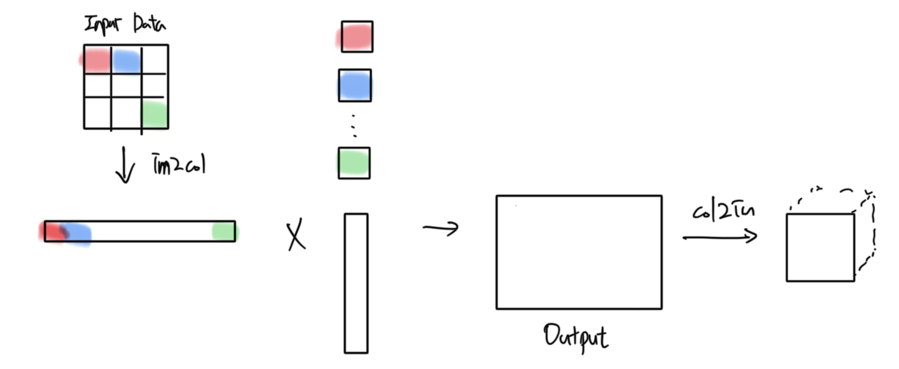
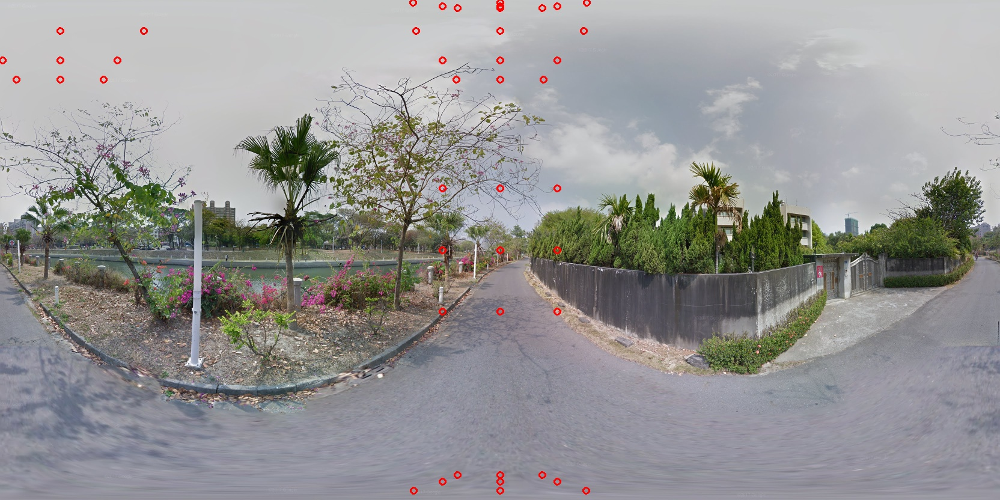
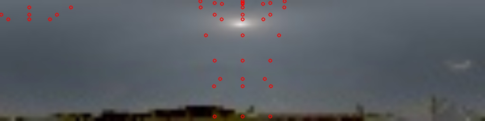

# Distortion-Aware Convolutional Filters for Dense Prediction in Panoramic Images (ECCV 2018)\[[Paper](https://www.ecva.net/papers/eccv_2018/papers_ECCV/papers/Keisuke_Tateno_Distortion-Aware_Convolutional_Filters_ECCV_2018_paper.pdf)\]
>
> Currently this code only supports `stride==1`. It will be updated.
>


Implemented distortion-aware convolutional filters in the simple classification model using tensorflow2.

# Note

The implemented code referenced [deformable convolutional layer](https://github.com/DHZS/tf-deformable-conv-layer/blob/master/nets/deformable_conv_layer.py).

# Requirements

- tensorflow >= 2.*

# Usage

It supports `conv2d` and `deconv2d` for downsampling and upsampling, respectively.

```python
import distortion_aware_ops as distortion
    
    c1 = distortion.conv2d(16, kernel_size=3, strides=1, dilation_rate=1, skydome=True)

    # Resize-based dilated convolutional layer
    c2 = distortion.deconv2d(16, kernel_size=3, strides=1, dilation_rate=1, skydome=True) 
```

# Filter Design

A 3D point mapped onto a 2D grid along an arrow from the "tangent plane of the unit sphere".

The implemented code can be checked from

```python
def distortion() # in distortion_aware_ops.py
```



# Convolution Operation Design

- im2col $\rightarrow$ Matrix multiplication $\rightarrow$ col2im
    
- Time complexity
    |                     |              |
    |---------------------|--------------|
    | General conv ops    | $O(n^3)$     |
    | This method         | $O(n^{2.73})$|

# Result

- Case 1 : Panoramic image (-90 to 90 degrees for elevation)

    ```
    python filter_movement_test.py --img pano_input.jpg --skydome False
    ```

    

- Case 2 : Skydome image (0 to 90 degrees for elevation)

    ```
    python filter_movement_test.py --img skydome_input.jpg --skydome True
    ```

    

# Train and Validation

```
python main.py
```
